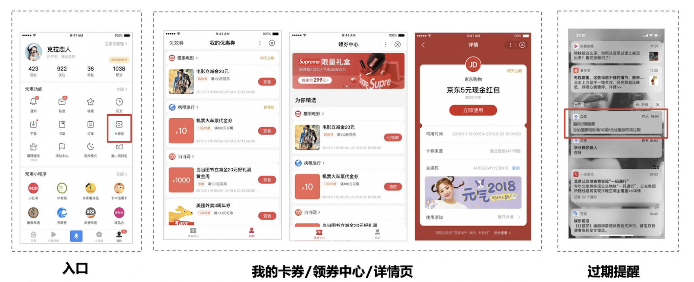
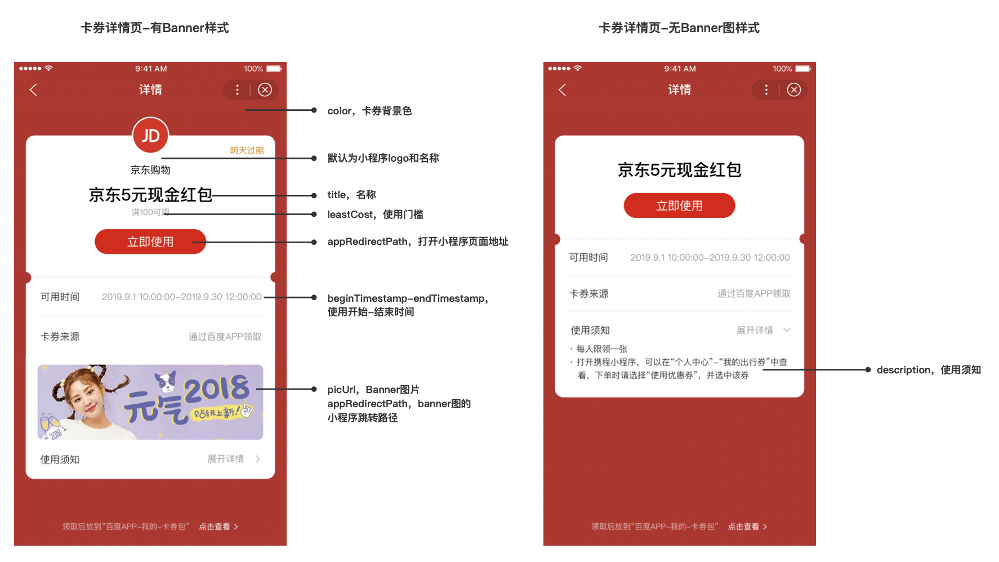
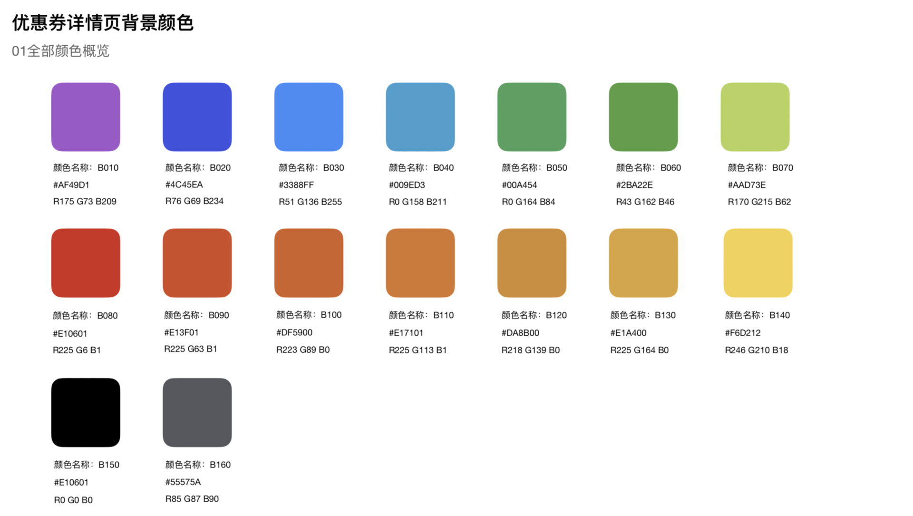
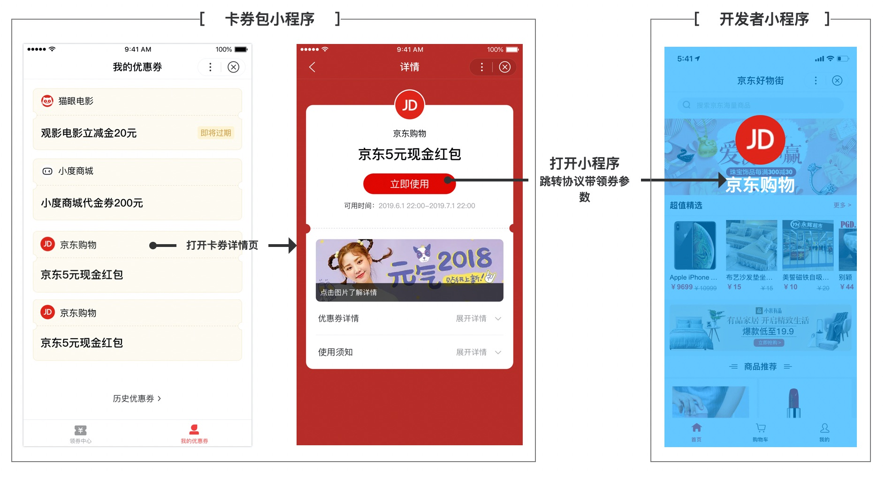

**接口目录**

> 1. 创建卡券  
> 1.1 步骤一：选取卡券背景色 
> 1.2 步骤二：选择卡券类型并创建卡券  
> 1.2.1卡券基础信息字段（重要） 
> 1.3 步骤三：上传Code码 
> 1.4 步骤四：上传卡券Banner图（可选） 
> 1.4.1 Banner创建 
> 1.4.2 Banner修改 
> 1.4.3 Banner删除 
> 1.4.4 Banner详情查询 
> 1.4.5 Banner列表批量查询 
> 
> 2. 领取卡券  
> 2.1 领券事件推送 
> 2.2 跳转协议带参数说明 
> 
> 3. 核销同步 
> 
> 4. 管理卡券 
> 4.1 查看卡券详情 
> 4.2 批量查询卡券列表 
> 4.3 删除卡券 

# 百度卡券
小程序为开发者提供接入百度卡券的免费接口，接入后可在百度多种运营资源进行投放，同时发放的优惠券统一进入用户的「卡券包」查看和管理，并引导用户直达商家小程序浏览及购买商品。
 

## 前提条件
1.	已完成[开发者入驻和小程序创建](https://smartprogram.baidu.com/docs/introduction/enter_application/)；
2.	已使用百度官方提供的[登录能力](https://smartprogram.baidu.com/docs/develop/api/open_log/)；
3.	开发者业务有优惠券功能，具备发券-核销能力。百度智能小程序仅作为平台投放、券的统一展示、集中管理。如，个人中心有我的优惠券/礼券/卡券等，用户可查看可使用。


# 1. 创建卡券
#### 开发步骤
 
##### 明确卡券ID与Code码的区别

创建卡券成功后获取百度分配的卡券ID，一个卡券ID代表一类卡券，包含相应库存数量的Code码。

>例如： 创建100元代金券，获取一个卡券ID（couponId）用于投放，并需开发者上传对应业务的Code码，根据上传Code码的数量，百度设置库存100万。
用户A，领取到商户投放的50元代金券时，券面上会有一个唯一的标识码，即Code码。每个用户的Code码都不相同，所以卡券发放时，百度将会派发100万个不同的Code码给用户。


#### 字段示意图
 

## 1.1 步骤一：选取卡券背景色
目前百度提供包括以上16种色值供开发者使用，选择适用的背景色，将背景色名称（如B010）填入color字段。
 

|背景色名称 | 背景色值 | 
|---|---|
|B010 | #9857AE | 
|B020 | #5854BE | 
|B030 | #487FCC | 
|B040 | #288DAF | 
|B050 | #28915E | 
|B060 | #449045 | 
|B070 | #95B250 | 
|B080 | #B82C28 | 
|B090 | #B85029 | 
|B100 | #B76229 | 
|B110 | #B87029 | 
|B120 | #B48228 | 
|B130 | #B89028 | 
|B140 | #C5AE34 | 
|B150 | #282828 | 
|B160 | #5F6062 | 


## 1.2 步骤二：选择卡券类型并创建卡券

百度提供以下3种卡券类型，1-代金券，2-折扣券，3-通用优惠券。

##### 接口地址
```
POST请求 https://openapi.baidu.com/rest/2.0/smartapp/v1.0/coupon/create?access_token=ACCESS_TOKEN
```
##### 请求参数

参数|说明
---|:--:
access_token |调用接口凭证
POST数据|Json数据

##### POST数据示例

```JSON
{
    "couponType":"DISCOUNT",
    "discount":30,
    "leastCost":100,
    "reduceCost":10,
    "baseInfo":{
        "title":"卡券标题",
        "color":"B10",
        "getLimit":3,
        "dateInfo":{
            "getStartTimestamp":1574952776,
            "getEndTimestamp":1577544776,
            "type":1,
            "beginTimestamp":1574952776,
            "endTimestamp":1577544776,
            "timeUnit":1,
            "timeValue":22
        },
       "appRedirectPath": "/pages/index/index"
    }
    "description":"使用描述",
    "callbackUrl":"卡券事件回调地址"
}
```


##### 1- 代金券

|参数 | 是否必传 | 类型 | 示例值 | 描述 | 
|---|---|---|---|---|
|couponType | 是 | String |CASH | 卡券类型 | 
|leastCost | 否 | Long | 1000 | 表示可使用的门槛金额（单位为分）,不传默认为0，即无起用门槛。| 
|reduceCost | 是 | Long | 500 | 代金券专用，表示减免金额（单位为分）。| 
|baseInfo	|是	|JSON结构	|见下面示例	|基本的卡券数据，见下表，所有卡券通用。|
|description | 是 | String | 打开小程序，①在个人中心-我的礼券可查看；②下单时选择该优惠券 | 使用须知：卡券使用方法的介绍 | 
|callbackUrl | 是 | String |  | 卡券领取事件推送地址| 

> **开发者须知**： 一个小程序内全部卡券的callbackUrl需为同一个。

```json
{
    "couponType":"CASH",
    "leastCost":100,
    "reduceCost":50,
    "baseInfo":{
    ················        
    },
    "description":"使用描述",
    "callbackUrl":"卡券事件回调地址"
}

```


##### 2- 折扣券

|参数 | 是否必传 | 类型 | 示例值 | 描述 | 
|---|---|---|---|---|
|couponType | 是 | String |DISCOUNT | 卡券类型 | 
|discount | 是 | Int | 80 | 折扣券专用，表示打折力度（格式为百分比），填80就是八折。| 
|baseInfo	|是	|JSON结构	|见下面示例	|基本的卡券数据，见下表，所有卡券通用。|
|description | 是 | String | 打开小程序，①在个人中心-我的礼券可查看；②下单时选择该优惠券 | 使用须知：卡券使用方法的介绍 | 
|callbackUrl | 是 | String |  | 卡券领取事件推送地址| 

```json
{
    "couponType":"DISCOUNT",
    "discount":30,
    "baseInfo":{
           ················        
     },
     "description":"使用描述",
     "callbackUrl":"卡券事件回调地址"
}

```

##### 3- 通用优惠券

|参数 | 是否必传 | 类型 | 示例值 | 描述 | 
|---|---|---|---|---|
|couponType | 是 | String |GENERAL | 卡券类型，当以上卡券类型无法满足时，可使用通用优惠券类型 | 
|baseInfo	|是	|JSON结构	|见下面示例	|基本的卡券数据，见下表，所有卡券通用。|
|description | 是 | String | 打开小程序，①在个人中心-我的礼券可查看；②下单时选择该优惠券 | 使用须知：卡券使用方法的介绍 | 
|callbackUrl | 是 | String |  | 卡券领取事件推送地址| 

```JSON
{
    "couponType":"GENERAL",
    "baseInfo":{
    ················        
    }
    "description":"使用描述",
    "callbackUrl":"卡券事件回调地址"
}
```

### 1.2.1卡券基础信息字段（重要）

|参数 | 是否必传 | 类型 | 示例值 | 描述 | 
|---|---|---|---|---|
|title | 是 | String | 当当图书20元立减金 | 优惠券名称，不能超出10个字 | 
|color | 是 | String | B010 | 卡券背景色，支持范围: [B010 ～ B160]| 
|dateInfo	|是	|JSON结构	|见上述示例	|使用日期，有效期的信息。|
|type | 是 | Integer | 1 | 券使用时间类型：1：开发者设置使用开始和结束时间；2：领取之后，多久可使用;当类型为1时，beginTimestamp和endTimestamp必传；当类型为2时，timeUnit和timeValue必传 | 
|beginTimestamp | 是 | Long | 1574952776 | 使用开始时间,当type为1时，beginTimestamp必传且生效； | 
|endTimestamp | 是 | Long | 1577544776 | 使用结束时间，当type为1时，endTimestamp必传且生效； | 
|timeUnit | 是 | Integer | 2 | 时间单位：1-时；2-天；3-月；当type为2时，timeUnit必传且生效； | 
|timeValue | 是 | Integer | 30 | 时间值；当type为2时，timeValue必传且生效； | 
|getLimit | 是 | Integer | 2 | 每人领取次数限制 | 
|getStartTimestamp | 是 | Long | 1574952776 | 开始领取时间 | 
|getEndTimestamp | 是 | Long | 1577544776 | 结束领取时间 | 
|appRedirectPath | 否 | String | pages/index/index | 已领取的卡券，从详情頁点击「立即使用」打开小程序页面地址，不传默认打开首页| 
|callbackUrl | 是 | String |  | 卡券领取事件推送地址| 

## 1.3 步骤三：上传Code码

##### 接口地址
```
    POST请求 https://openapi.baidu.com/rest/2.0/smartapp/v1.0/coupon/code/batchUpload?access_token=ACCESS_TOKEN
```

##### 请求参数

|参数 | 说明 | 类型 | 是否必传 | 备注 | 
|---|---|---|---|---|
|couponId | 卡券ID | String | 是 |  |  
|couponCodes | 卡券Code码列表 | String | 是 | 使用`,`隔开，最多传100 | 

##### 返回示例
```
{
    "errcode": 0,
    "errmsg": "success",
    "data": {
          "successNum":5,
          "failNum":2  //重复导入的code会忽略
     }
}

```

## 1.4 步骤四：上传卡券Banner

### 上传图片接口
为了保证开发者的卡券在用户的能快速、稳定地加载出图片素材，我们强烈建议开发者将卡券素材先调用接口导入百度服务器。

开发者需调用该接口上传商户图标至百度服务器，获取相应picUrl（卡券Banner图片）。请求参数为`file`，上传图片后，获取返回url。

##### 请求地址
```
    https://openapi.baidu.com/file/2.0/smartapp/v1.0/coupon/upload/image?access_token
```
##### 返回示例

    {
        "errno": 0,
        "msg": "success",
        "data": {
            "url": "https://b.bdstatic.com/searchbox/mappconsole/image/20191128/8d382c36-2b85-4f2c-b6d1-0d6afbc04dc8.png"
        }
    }


### 1.4.1 Banner创建
##### 请求地址
```
    POST请求 https://openapi.baidu.com/rest/2.0/smartapp/v1.0/coupon/banner/add?access_token=ACCESS_TOKEN
```
##### 请求参数

参数|说明
---|:--:
access_token |调用接口凭证
POST数据|Json数据


##### POST数据示例
```JSON
{
    "couponId":"xxx",
    "picUrl":"/index/index",
    "title":"卡券标题",
    "appRedirectPath":"跳转的小程序页面路径"
}
```

|参数 | 说明 | 类型 | 是否必传 | 
|---|---|---|---|---|
|couponId | 卡券ID | String | 是 |    
|picUrl | 卡券banner图片 | String | 是 |   
|title | 卡券banner图标题 | String | 是 |    
|appRedirectPath |  banner图跳转的小程序页面路径 | String | 否 | |  
开发者须知：图片尺寸：1032* 144px；

##### 返回示例
```
{
    "errcode": 0,
    "errmsg": "success",
    "data": {
        "bannerIds": 23830865
    }
}
```

###  1.4.2 Banner修改

##### 请求地址
```
    POST请求 https://openapi.baidu.com/rest/2.0/smartapp/v1.0/coupon/banner/update?access_token=ACCESS_TOKEN
```
##### 请求参数

参数|说明
---|:--:
access_token |调用接口凭证
POST数据|Json数据

##### POST数据示例
```
{
    "bannerIds":"bannerIds",
    "couponId":"xxx",
    "picUrl":"www.baidu.com",
    "title":"标题",
    "appRedirectPath":"跳转小程序页面路径"
}
```

##### 参数说明

|参数 | 说明 | 类型 | 是否必传 | 
|---|---|---|---|---|
|couponId | 卡券ID | String | 是 |   
|bannerIds | 卡券banner记录id | Long | 是 |    
|picUrl | 卡券banner图片 | String | 是 |   
|title | 卡券banner图标题 | String | 是 |   
|appRedirectPath | banner图跳转的小程序页面路径 | String | 否 |  |  

##### 返回示例
```
{
    "errcode": 0,
    "errmsg": "success",
    "data": true
}
```

### 1.4.3 Banner删除

##### 请求地址
```
    https://openapi.baidu.com/rest/2.0/smartapp/v1.0/coupon/banner/delete?access_token=ACCESS_TOKEN
```
##### 请求参数

|参数 | 说明 | 类型 | 是否必传 | 
|---|---|---|---|---|
|couponId | 卡券ID | String | 是 |  
|bannerIds | 卡券banner记录id | Long | 是 |  |  
##### 返回示例
```
{
    "errcode": 0,
    "errmsg": "success",
    "data": true
}
```

### 1.4.4 Banner详情查询

##### 请求地址
```
    https://openapi.baidu.com/rest/2.0/smartapp/v1.0/coupon/banner/get?access_token=ACCESS_TOKEN
```
##### 请求参数

|参数 | 说明 | 类型 | 是否必传 | 备注 | 
|---|---|---|---|---|
|couponId | 卡券ID | String | 是 |  |  
|bannerIds | 卡券banner记录id | Long | 是 |用`,`分隔多个bannerIds ，最大值限制20|  
##### 返回示例
```
{
    "errcode": 0,
    "errmsg": "success",
    "data": [
        {
            "bannerIds": 23830865,
            "couponId": "23830866",
            "title": "titletest",
            "picUrl": "picUrlTest",
            "appRedirectPath": "destUrlTest",
            "createTime": 1574396789,
            "updateTime": 1574396788
        }
    ]
}
```

### 1.4.5 Banner列表批量查询
##### 请求地址    
```
    https://openapi.baidu.com/rest/2.0/smartapp/v1.0/coupon/banner/batchGet?access_token=ACCESS_TOKEN
```
##### 请求参数

|参数 | 说明 | 类型 | 是否必传 | 默认值 |
|---|---|---|---|---|---|
|couponId | 券id | String | 是 |  |  
|picUrl | 卡券图片推广图链接地址 | String | 否 |  |  
|title | 卡券图片推广图标题 | String | 否 |  |   
|pageNum | 页码，默认值为: 0 | Integer | 否 | 1 |   
|pageSize | 页大小，默认值为: 20 | Integer | 否 | 20 |  | 
##### 返回示例
```
{
    "errcode": 0,
    "errmsg": "success",
    "data": {
        "pageNo": 1,
        "total": 1,
        "dataList": [
            {
                "bannerIds": 23830865,
                "couponId": "23830866",
                "title": "titletest",
                "picUrl": "picUrlTest",
                "appRedirectPath": "destUrlTest",
                "createTime": 1574396789,
                "updateTime": 1574396788
            }
        ]
    }
}
```


# 2. 领取卡券
用户在百度领券流程：
1）	用户在百度卡券包等运营资源位上领券；
2）	百度记录用户的领取记录，返回用户领券成功；
3）	通过异步通知和跳转协议带参数两种途径，告知开发者用户的领取记录；
注意：开发者收到后需为用户下发真实优惠券；

## 2.1 领券事件推送

用户在领取卡券时，百度会把这个事件推送到开发者填写的`callbackUrl`上。

##### 接口调用说明

开发者收到百度的领券推送后，需开发部分：为用户下发真实优惠券，保证用户在开发者的小程序内正常用券。

 

开发者须知：本期只支持json数据格式输出。

推送XML数据包示例：

```
    <xml>
       <ToUserName> <![CDATA[app_id]]> </ToUserName>
        <FromUserName> <![CDATA[open_id]]> </FromUserName>
        <CreateTime>1472551036</CreateTime>
        <MsgType> <![CDATA[event]]> </MsgType>
        <Event> <![CDATA[user_get_card]]> </Event>
        <CouponId> <![CDATA[pZI8Fjwsy5fVPRBeD78J4RmqVvBc]]> </CardId>
        <UserCouponCode> <![CDATA[226009850808]]> </UserCardCode>
        <CouponTakeId><![CDATA[xxxxx]]> </CouponTakeId>
    </xml>
```

推送JSON数据包示例:


```json
    {
        "ToUserName":"app_id",
        "FromUserName":"open_id",
        "CreateTime":"1472551036",
        "MsgType":"event",
        "Event":"user_get_card",
        "CouponId":"pZI8Fjwsy5fVPRBeD78J4RmqVvBc",
        "CouponCode":"226009850808",
        "CouponTakeId":"xxxxx"
    }
```


#### 参数说明

|参数 | 说明 | 
|---|---|
| ToUserName |开发者app_id |
|FromUserName	|领券用户的OpenID|
|CreateTime	|消息创建时间 （整型）|
|MsgType	|消息类型，event|
|Event	|事件类型，user_get_card(用户领取卡券)|
|CouponId|卡券ID|
|UserCouponCode|卡券Code码|
|CouponTakeId	|卡券领取标识，调用核销同步接口时必传|


## 2.2 跳转协议带参数说明（此次活动需接入）
百度会在用户从卡券详情点击「立即使用」的时机，即跳转打开开发者小程序的跳转协议中，带上该券的领券参数，开发者拿到参数后，对参数进行解密，可以获取到该用户的领券信息。

开发者须知：正常情况下，开发者会在用户领券后，先收到百度的领券事件推送（异步通知）；但高并发的领券场景下，推送可能会存在延迟，作为互补方案，当用户从该路径去使用券时，开发者也需要及时获取领券结果，保证用户正常用券。

 

##### 接口调用说明

 
涉及开发者端+Server开发：
1）端开发：开发者需在卡券详情页点击去使用跳转的页面上，通过 [onLoad(Object query)](https://smartprogram.baidu.com/docs/develop/framework/app_service_pagelife/) 获取打开当前页面路径中的`coupon` 参数；
> **开发者须知**
> 若「立即使用」 点击跳转的页面为首页，需在小程序首页页面上增加onLoad能力开发；需设置为自定义跳转页面，需在该页面增加onLoad能力开发。

2）Server开发：对`coupon`参数进行解密，获取到用户的领券信息，为用户发券；

##### 协议拼接格式说明
```
如果吊起协议之前无参数用"?"追加，如下：
?coupon=encryptData

如果吊起协议之前有参数用"&"追加，如下：
?p1=xxx&coupon=encryptData

```

##### 解密结果说明

```
{"open_id":"xxx","coupon_id":"xxx","coupon_code":"xxx","app_key":"xxx","coupon_take_id":"xxx"}
```
##### 参数说明

| 参数 | 是否必须 | 说明
| --- | --- | --- |
| open_id | 是 | 用户openId
| coupon_id | 是 | 卡券ID
| coupon_code | 是 | 卡券Code码，小程序开发者创建时上传的Code码
| app_key | 是 | 小程序appKey
| coupon_take_id | 是 | 卡券领取标识，调用核销同步接口时必传|

# 3. 核销同步

用户用券环节在开发者小程序内完成，开发者服务器核销掉该卡券后，需调用核销同步接口，同步至百度服务器。
##### 接口调用说明
 

##### 接口请求说明
```
POST请求 https://openapi.baidu.com/rest/2.0/smartapp/v1.0/coupon/code/consume?access_token=ACCESS_TOKEN
```
##### 请求参数

|参数 | 说明 |
|---|---|
|access_token |调用接口凭证|
|POST数据|Json数据|

##### 请求参数

|参数 | 说明 | 类型 | 是否必传 | 
|---|---|---|---|---|---|
|couponId | 卡券ID | String | 否 |  
|couponTakeId | 百度分配的用户领取id | Long | 是 |  
|couponCode | 劵码 | String | 是 |    
|openId | 用户id | string | 是 |  |   

返回示例
```
{
    "errcode": 0,
    "errmsg": "success",
    "data": true
}
```

# 4. 管理卡券

### 4.1 查看卡券详情
##### 请求地址
```
    https://openapi.baidu.com/rest/2.0/smartapp/v1.0/coupon/get?access_token=ACCESS_TOKEN
```
##### 请求参数

|参数 | 说明 | 类型 | 是否必传 | 
|---|---|---|---|---|---|
|couponId | 卡券ID | String | 是 |  |  

##### 请求参数
```
{
    "errcode":0,
    "errmsg":"success",
    "data":{
        "couponId":"xxxx",
        "couponType":"DISCOUNT",
        "discount":30,
        "baseInfo":{
            "title":"卡券标题",
            "color":"B10",
            "getLimit":3,
            "dateInfo":{
                "getStartTimestamp":1574952776,
                "getEndTimestamp":1577544776,
                "type":1,
                "beginTimestamp":1574952776,
                "endTimestamp":1577544776,
                "timeUnit":1,
                "timeValue":22
            }
        },
        "description":"使用描述",
        "callbackUrl":"卡券事件回调地址"
    }
}
```


### 4.2 批量查询卡券列表
接口描述：批量查询卡券接口。
##### 请求地址：
```
    GET  https://openapi.baidu.com/rest/2.0/smartapp/v1.0/coupon/batchGet?access_token=ACCESS_TOKEN
```

|参数 | 说明 | 类型 | 是否必传 | 默认值 | 
|---|---|---|---|---|---|
|title | 券名称 | String | 否 |  |   
|couponType | 券类型 | String | 否 |  |    
|pageNum | 页码，默认值为: 0 | Integer | 否 | 0 |   
|pageSize | 页大小，默认值为: 20 | Integer | 否 | 20 |  | 

##### 返回示例
``` 
{
    "errcode":0,
    "errmsg":"success",
    "data":{
        "pageNo":1,
        "total":3,
        "dataList":[
            {
                "couponType":"DISCOUNT",
                "discount":30,
                "baseInfo":{
                    "title":"卡券标题",
                    "color":"B10",
                    "getLimit":3,
                    "dateInfo":{
                        "getStartTimestamp":1574952776,
                        "getEndTimestamp":1577544776,
                        "type":1,
                        "beginTimestamp":1574952776,
                        "endTimestamp":1577544776,
                        "timeUnit":1,
                        "timeValue":22
                    }
                },
                "description":"使用描述",
                "callbackUrl":"卡券事件回调地址"
            }
        ]
    }
}
```

### 4.3 删除卡券
##### 请求地址 
```
POST请求 https://openapi.baidu.com/rest/2.0/smartapp/v1.0/coupon/delete?access_token=ACCESS_TOKEN
```
##### 请求参数

|参数 | 说明 | 类型 | 是否必传 | 
|---|---|---|---|---|---|
|couponId | 卡券ID | String | 是 |  |  

##### 返回示例

```
    {
        "errcode": 0,
        "errmsg": "success",
        "data": true
    }
```

开发者须知：卡券管理当前不提供更新卡券接口，如有更新需求，需重新创建卡券。


