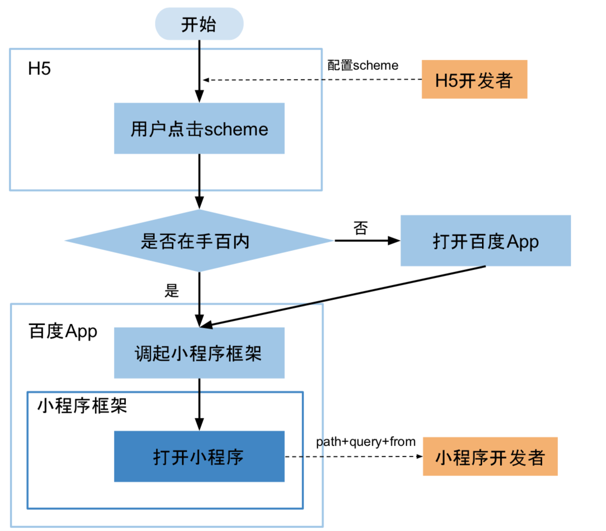

我们除了为小程序提供搜索、信息流等流量入口，还为小程序开发者提供了自主开发小程序入口的能力，如：扫码打开小程序，在H5中打开智能小程序，在小程序中打开另一小程序。开发者可以利用这些能力自主开发小程序入口，提升小程序流量。

## 打开小程序原理

>下面的内容可以稍作了解，我们提供了封装好的[调起能力](#调起功能开发)，可以根据不同场景直接调用。

### URL Scheme

URL Scheme是一种 App 间的调起协议。App 内部注册协议后，当用户在浏览器或其他 App 内点击相应的 scheme 链接，就能够调起 App 并打开 App 内的相关页面。
下面是“智能小程序示例“小程序的调起scheme：


<table>
<tr>
    <td></td>
    <td>字段</td> 
    <td>说明</td>   
</tr>
<tr>
    <td>Sheme</td>
    <td>baiduboxapp</td> 
    <td>scheme协议。这部分表示使用百度App处理这个url。使用百度App打开小程序时，这部分保持不变。</td>   
</tr>
<tr>    
    <td rowspan="4"> Source</td>
    <td>swan</td>
    <td>小程序标识，保持不变。用来通知百度App调起小程序框架。</td>
</tr>
<tr>    
    <td>appKey</td>
    <td>想要打开的小程序appKey。</td>   
</tr>
<tr>     
    <td>page</td>
    <td>小程序打开的页面路径。页面路径可以在小程序代码app.json文件的pages属性中取到，常见形式为`"pages/index/index"`。page为空或不正确，则打开首页。</td>
</tr>
<tr>    
    <td>query</td>   
    <td>小程序页面路径参数</td>           
</tr>
</table>

> **一般情况下开发者不需要手动拼写scheme**，可以通过[调起协议生成工具](https://smartprogram.baidu.com/docs/html/qr-code/index.html#/)快速生成scheme，使用方法参考[scheme生成工具](#scheme生成工具)。

### 小程序调起机制

小程序调起机制如下图，当用户在 H5 页面中点击含有 Scheme 协议的 url 时：
1. 移动设备会识别 scheme 协议，打开百度 App，并将 url 的 Source 传递给百度 App。
2. 当百度 App 接受到 source 后，识别小程序标识，调起小程序框架。
3. 小程序框架通过 appKey 加载小程序代码，打开指定小程序。
4. 小程序根据 path 和 query 渲染具体页面，加载页面内容。



##  scheme生成工具

开发者在商业投放、上线前验证等场景下可能需要获取小程序调起协议（scheme），这时可以通过[调起协议生成工具](https://smartprogram.baidu.com/docs/html/qr-code/index.html#/)快速生成小程序scheme和二维码。

生成工具的参数填写示例如下：


其中需要填写的参数，与scheme的对应关系如下：

|参数名 |对应scheme参数| 参数含义 |
|---|---|---|
| App Key |appKey| 小程序appKey |
| 启动页面 |page | 打开的小程序页面路径 |
| 启动参数 |query | 小程序路径的参数|
| 进入场景 |from | [场景值](https://smartprogram.baidu.com/docs/data/scene/)  |

## 调起功能开发

根据小程序打开场景的不同，我们根据不同场景，封装了三种能力帮助开发者为自己的小程序添加入口，分别为：
* H5 打开小程序
* 小程序打开小程序
* 在web-view中打开小程序 

> 使用这三种能力开发调起功能，只需要配置必需的小程序参数，不需要开发者拼接 scheme。

### H5打开小程序

如果开发者有自己的H5页面，在H5中想要打开小程序时，可以使用我们提供的H5通用调起SDK——swanInvoke。
swanInvoke功能：

 - 自动拼接scheme
 - 判断浏览器和系统环境，选择最佳的方法调用scheme，打开小程序。
 - 同时支持百度App端内端外跳转
 - 如果跳转失败，引导用户以其他方式打开
 
1. 引用

    像其他javascript库一样，在html中用script标签引入。
    **代码示例**
    ```javascript
    <!DOCTYPE html>
    <html>
    <head>
        <meta charset="utf-8">
        <!-- 引入 调起sdk 文件 -->
        <script type="text/javascript" src="https://b.bdstatic.com/searchbox/icms/searchbox/js/swanInvoke.js"></script>
    </head>
    </html>
    ```

2. 调起方法

    在绑定事件中调用swanInvoke方法触发调起功能。
    **代码示例**
    ```
    <body>
        <button id='btn'>调起</button>
        <script type="text/javascript">
        document.getElementById('btn').addEventListener('click', function () {
            window.swanInvoke({
                appKey: '4fecoAqgCIUtzIyA4FAPgoyrc4oUc25c',
                path: 'pages/view/view',
                query: {
                    id:1,
                    type: 'a'
                }
            });
        });
    </script>
    </body>
    ```
    >由于原生能力限制，在某些环境下，scheme调起必须由用户行为触发。请尽量绑定用户事件触发swanInvoke方法。

3. swanInvoke()方法参数说明

|参数名 | 类型 | 必填 | 默认值 | 说明 | 
|---|---|---|---|---|
| appKey | String | 是 | - | 要打开的小程序App Key | 
| path | String | 否 | - | 要打开的小程序页面的路径 | 
| query | Object | 否 | - | 给小程序传递的参数 | 
| failUrl | String | 否 | 默认的调起中间页 | 调起小程序失败后H5跳转页面 |
| timeout | Number | 否 | 200 | 非百度app内打开H5页面调起小程序，跳转到failUrl的延时 | 

这里的appKey、path、query，对应scheme中的同名参数（scheme参数请参考[URL Scheme](#URL-Scheme)）。
> swanInvoke方法的query可以填写Object类型，不需要拼接成类似“aa=1&bb=2“的字符串形式。具体形式参考代码示例。

4. 调起失败

    如果用户没有安装百度App，或由于某些浏览器或App禁止跳转到其他App，会出现调起失败的情况。调起失败默认跳转到我们提供的中间页，引导用户用其他方式跳转小程序。如果想要自己设置调起失败跳转页面，可以配置failUrl参数，代码示例如下：
    **代码示例**
    ```
    window.swanInvoke({
        appKey: '4fecoAqgCIUtzIyA4FAPgoyrc4oUc25c', 
        path: 'pages/view/view',
        failUrl: 'https://www.baidu.com' // 调起失败跳转的页面
    });
    ```

    > 暂不支持在宿主APP中打开小程序。
    > 百度APP安卓11.15版本以下，不支持非百度域的H5页面打开小程序。
    

### 小程序打开小程序

在小程序中打开另一个小程序可以通过组件或API的方式。

* 组件：在小程序中使用组件打开另一个小程序，请参考[navigator组件](/develop/component/nav/)中target="miniProgram"的使用方法。

* API：在小程序中使用API打开另一个小程序，请参考[swan.navigateToSmartProgram](https://smartprogram.baidu.com/docs/develop/api/open/swan-navigateToSmartProgram/)

### 在web-view中打开小程序 

在小程序的web-view中打开另一个小程序，需要在引入jssdk后，调用swan.navigateToSmartProgram接口。

引入jssdk和接口调用的详细方法，请参考[web-view 网页容器](/develop/component/open_web-view/#相关接口2)

### 如何判断H5页面是否在小程序web-view打开？

H5 运行时，通过 window.navigator.userAgent 获取浏览器 userAgent。当 userAgent 字符串中包含小程序标识：‘swan/’时，则说明当前环境为小程序 web-view。

## 小程序来源统计
> 百度已为小程序提供了搜索、信息流等流量入口。这部分流量可以在开发者平台——数据统计——来源统计中查看。

如果需要统计自行开发的小程序入口，或当开发者平台不能满足统计需求时，可以使用下面的方法，在小程序中手工打点统计。

1. 开发调起功能时，配置对应的调起参数。

2. 在小程序 [App()](/develop/framework/app_service_register/) 生命周期函数的`onLaunch`和`onShow`中取得 Scheme 中小程序的相关参数。
   **代码示例**
   ```
   App({
       onShow: function (options) {
           swan.requrest({
               path: options.path, // 小程序路径
               query: options.query，// 小程序传入的参数
               scene: options.scene // 场景值
           })
       },
   })
   ```
   两种调起能力的配置参数，与onShow中获取的参数名称不完全相同，参数对应关系如下表所示。

|参数| H5打开小程序配置参数名  | 小程序打开小程序配置参数名 | onShow中获取的参数名|
|---|---|---|---|
| 小程序appKey | appKey | app-id | - |
| 小程序页面路径 | path  | path | path |
| 小程序路径的参数 | query | extra-data | query |
| 入口场景值 | - | - |scene|

   场景值说明
   * 百度各流量入口自动添加了场景值，标识小程序入口。想了解场景值对应的小程序入口，请参考[场景值](https://smartprogram.baidu.com/docs/data/scene/)文档。
   * 为防止污染已有的入口场景数据，调起能力的场景值固定，不可配置。使用调起能力开发时，如需区分开发的多个入口，可以在query中添加自定义参数作以区分。

3. 对获取的参数值进行埋点数据上报。具体实现方式与其他统计需求，如UV、PV等，可以参考[手工埋点统计](https://smartprogram.baidu.com/docs/data/performance-point/)。


